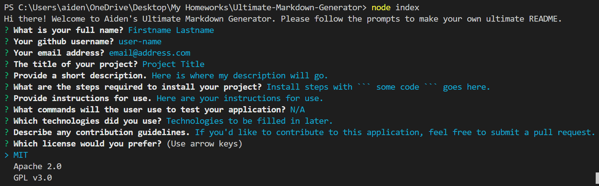

# Ultimate Markdown Generator
[](https://opensource.org/licenses/MIT)


    
## Description

This is a command-line application that generates an organized and professional markdown. Using prompts in the terminal, the **Ultimate Markdown Generator** creates a README from user input that includes a title, as well as sections for a description, table of contents, installation, usage, technologies used, tests, contributing, and questions.

***

#### Table of Contents

- [Description](#description)
- [User Story](#user)
- [Installation](#installation)
- [Usage](#usage)
- [Demo](#demo)
- [Tech Used](#tech)
- [Contributing](#contributing)
- [License](#license)
- [Questions](#questions)

***

### User Story

```
AS A developer
I WANT a README generator
SO THAT can quickly create a professional README for a new project
```

### Installation

**1.** Clone repository

**2.** In the command line, type:
  >  ```npm install ```
  >
  >  ```npm install moment```

### Usage

In your command line, type ```node index``` and follow the prompts to generate the ULTIMATE markdown within moments.

### Demo


***To see a full video of this application in action, [click here!](https://youtu.be/4LwsgW0qiF0)***
    
### Contributing

If you'd like to contribute to this application, feel free to submit a pull request!
    
### License

This project is licensed under MIT.

### Questions

If you have any questions, please [email me.](mailto:aiden.threadgoode@gmail.com)

If you'd like to see more of my work, feel free to check out [my github!](https://github.com/a-thread)

*© 2020 Aiden Threadgoode*
    
